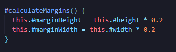
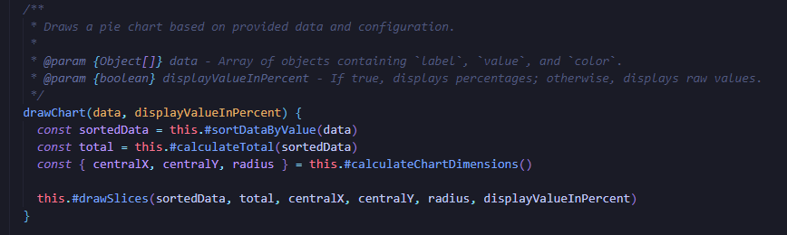
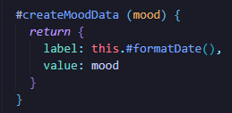
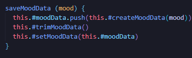
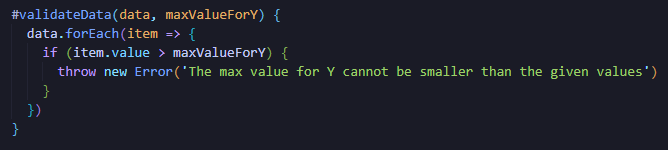
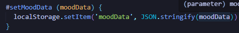
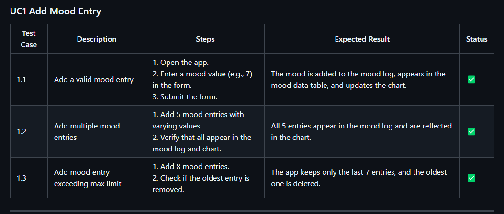
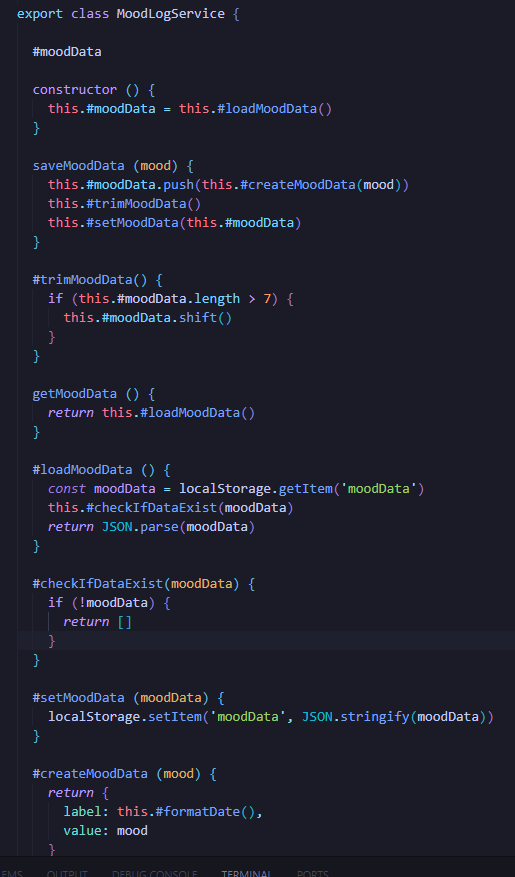

# Reflektioner för kapitel 2 till 11 i boken Clean Code

## Kapitel 2 - Meningful Names
  Namngivning anser jag är en viktig aspekt inom god kodstandard. Jag har försökt att använda mig av tydligt beskrivande namn för både variabler som metoder. Alla metoder har skrivits som verb, och klassernas namn är alla substantiv. Jag har förbättrat en del namn i modulen, och försökt fortsätta med tydliga och beskrivande namn i applikationen.

## Kapitel 3 - Funcions
Detta kapitel har jag försökt utgå från mest, då stora metoder med många indenteringar har varit en stor brist hos mina kod egenskaper. Detta har varit en utmaning, men har samtidigt hjälpt mig att förstå koden bättre, och har hjälpt en hel del när det kommer till problemlösning. Dock har jag ej följt principen att inte ha för många argument bra. På grund av hur jag skapade mina stora metoder i början av utvecklingsprocessen, så var det svårt att dela upp koden utan många argument. Det man kan göra här är att istället samla argumenten i objekt vilket jag har försökt göra.

## Kapitel 4 - Comments
Kommentarer har jag använt sparsamt och endast när det verkligen behövs. Boken är relativt negativ till kommentarer, vilket kan vara förstårligt, då bra kod ska kunna förklara sig själv. Jag har lärt mig att namnge metoder för att enklare förstå dess användning, utan att behöva ge onödiga kommentarer. I ett tillfälle där jag har använt mig av kommentarer, är angående argument av typen objekt. Detta för att det annars inte riktigt är synligt vad som faktiskt ska skickas med i argumenten. I detta fallet kan det vara bra att använda sig av kommentarer, när det inte finns något annat val.

## Kapitel 5 - Horizontal Formatting
Kapitel 5 tar upp om formattering av kod. Koden ska inte ha för långa rader, ska ha en del så kallat "white space" emellan för att visa separation, och dessutom är indention viktigt. Detta har jag varit noggran under denna process. Ibland har det var svårt att bryta ner längre rader, men jag har försökt att göra det på de allra flest ställen. Här nedan finns ett exempel där jag delade ett objekt på flera rader.

## Kapitel 6 - Objects and Data Structures
Objekt och data strukturer handlar om att hålla metoden och klassen fokuserad, minimera parametrar, samt hålla funktionaliteten inkapslad. Här nedan finns ett exempel där jag följer flera principer, som tas upp i kapitel 6. Jag kapslar in logiken i hur ny data skapas och lagras och ger metoden ett tydligt syfte i objektet.

## Kapitel 7 - Error Handling
Ett dåligt beteende jag hade förr, var att returnera null i många fall där ett fel istället hade behövts kastas. Att returnera null är inte bra enligt detta kapitel. Under denna process har jag inte gjort detta misstag, och har istället kastat felmeddelanden eller returnerat något mer passande i kontextet. I de kastade felen har jag skickat med tydliga meddelanden så användaren kan förstå vad som har blivit fel. Genom att jag kastar undantag och fångar upp dem för att hantera fel, så separereas felhanteringen från logiken. I modulen skapade jag dessutom en helt egen klass för att validera kod. Om jag hade haft mer tid och planerat bättre, hade jag dessutom lagt in det i applikationen. 

## Kapitel 8 - Boundaries
Externa bibliotek och redan färdiga metoder kan hjälpa oss under kodningen, och kan göra mer komplexa lösningar enkla för oss att använda. Dock kan det samtidigt skapa beroenden av tredjeparsverktyg, och göra det svårare att förstå koden i sig om problem skapas. Jag har inte använt mig av installera beroenden, förutom min egna modul. Dock hänger en stor del av min applikation på localStorage som är en inbyggd metod. Om jag i framtiden skulle vilja ändra till en databas, så kommer det bli svårare att anpassa eftersom min klass är direkt kopplad till local storage. 

## Kapitel 9 - Unit Tests
Kapitel 9 tar upp angående vikten av enhetstestar samt att skriva lättlästa, isolerade och snabbt gjorda tester. Genom att skriva bra enhetstester kan ett större förtroende av att koden fungerar som den ska göra. Jag har försökt använda mig av automatiserade enhetstester under arbetet med modulen, men fick det inte att fungera tyvärr. Jag har därför fått använda mig av manuella testfall, som tar längre tid att göra och blir rätt så upprepande. Dock anser jag att jag har försökt separera logik och isolera funktionalitet för att enklare kunna testa koden utan att påverka andra delar. 

## Kapitel 10 - Classes
I kapitel 10 betonas vikten av sammanhängande klasser med välavgränsade ansvar. Jag har försökt att dela upp kodens logik så mycket som möjligt, för att kunna hålla ansvaret isolerat. I exemplet här nedan finns klassen MoodLogSrvice som endast fokuserar på att hantera och spara data. Jag använder mig också av privata metoder och fält som döljer större delen av implementationen. Därför visar denna klass att den är både väldefnierad, enkel att förstå samt sammanhängande.

## Kapitel 11 - Systems
I kapitel 11 tas det upp angående hantering av komplexitet i system, samt hur det kan underlätta att använda sig av tydliga gränssnitt och minimera kopplingar mellan komponenter. Jag har försökt att endast koppla samman klasser som verkligen är beroende av varandra. Jag har bland annat en main controller klass, som hanterar interaktionen mellan olika delar av systemet. Här samordnas interkationen mellan MoodLogsService och diagrammodulen. Här kan varje del också bytas ut utan att påverka resterande del av systemet. 

